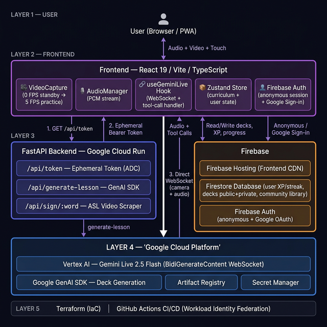
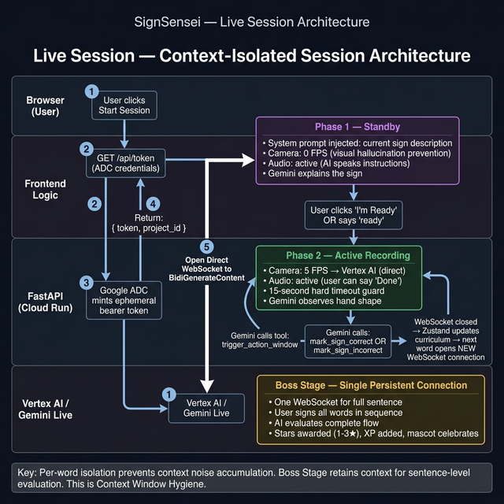
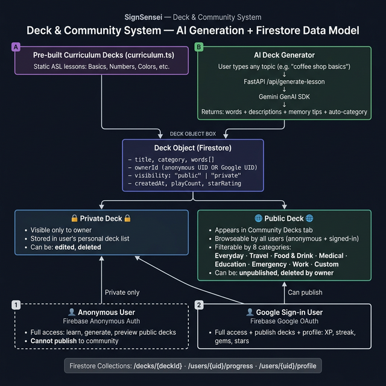

# 🤟 SignSensei

[](https://signsensei.web.app)
[](https://cloud.google.com/run)
[](https://deepmind.google/technologies/gemini/)
[](./terraform/)

**SignSensei** is a real-time, AI-powered American Sign Language (ASL) tutor built for the [Gemini Live Agent Challenge](https://geminiliveagentchallenge.devpost.com/).

It transforms ASL learning from passive video-watching into a **live, bidirectional conversation** — the AI tutor sees your hands via your webcam, gives instant spoken feedback, and guides you through a structured curriculum. No text boxes. No turn-taking. Just you, your hands, and a live AI that's watching.

> 🚀 **Try it instantly — no account required.** Anonymous sessions are fully supported. Open [signsensei.web.app](https://signsensei.web.app), click **Get Started**, and you're learning ASL in under 10 seconds.


---

## 🏗️ Architecture

### System Overview



> **Key design decision:** The Gemini Live 2.5 Flash WebSocket connects **directly from the browser** to Vertex AI using a short-lived ephemeral token minted by the backend. This eliminates transcoding latency that would occur if video/audio were proxied through Cloud Run, while keeping all GCP credentials server-side. This is Google's recommended pattern for real-time Live API applications.

---

### Live Session — Context-Isolated Session Flow



---

### Deck & Community System — Firestore Data Model



---

## ✨ Features

### 🎓 Live AI Tutoring Session
- **Real-time vision grading** — Gemini Live 2.5 Flash watches your webcam feed and grades your ASL signs as you perform them
- **Voice-first interaction** — The AI tutor speaks instructions, you sign, you say "Done" — no typing
- **Smart Standby Engine** — Camera sends `0 FPS` while the AI is instructing (prevents visual hallucinations from idle hand positions). Switches to `5 FPS` only during your active signing window
- **Deterministic grading via tool calls** — Curriculum progress is controlled by Zustand state gates, not by the LLM's own judgment. Gemini cannot hallucinate lesson advancement
- **15-second safety timeout** — Active recording windows are hard-capped to save Vertex AI tokens if a user walks away
- **Interruption support** — Users can speak at any time; Gemini's VAD handles natural barge-in

### 📚 Structured Curriculum
- Saga-map style lesson progression (Duolingo-inspired)
- Lessons unlock sequentially; each word is a node
- Boss Stage — a final composite challenge before lesson completion
- Star ratings (1–3★) based on performance
- XP, streaks, gems, and level gamification

### 🤖 AI Deck Generator  
- Type any topic in natural language (e.g. *"coffee shop phrases"*)
- Gemini generates a custom ASL lesson deck with words, descriptions, and memory tips
- Auto-categorizes decks into 8 categories (Everyday, Travel, Food & Drink, etc.)
- Community sharing — publish decks for other users; browse by category

### 🎭 Mascot Emotion System
- 7-state emotion mascot reacts to lesson events: `celebrate`, `oops`, `thinking`, `hopeful`, `sad`, `hyped`, `wave`
- Driven by real AI grading outcomes (correct sign → celebrate, wrong sign → oops)
- Animated via Rive + Framer Motion

### 📱 Full PWA
- Installable on iOS and Android home screens
- Offline-capable navigation (service worker)
- Landscapemode support during live sessions

---

## 🏛️ Technical Architecture

| Layer | Technology | Purpose |
|:---|:---|:---|
| **Frontend** | React 19, Vite, TypeScript | SPA, PWA |
| **Styling** | Tailwind CSS, Framer Motion | Dark glassmorphism UI |
| **State** | Zustand (client) + TanStack Query (server) | Split-brain architecture |
| **AI (Live)** | Gemini Live 2.5 Flash — `gemini-live-2.5-flash-native-audio` | Real-time vision + audio tutoring |
| **AI (Decks)** | Google GenAI SDK — `gemini-2.0-flash-lite` | Lesson generation |
| **Backend** | Python FastAPI | Ephemeral token service + deck API |
| **Deployment** | Google Cloud Run (serverless container) | Backend hosting |
| **Frontend CDN** | Firebase Hosting | Frontend delivery |
| **Database** | Firestore | User progress, decks |
| **Auth** | Firebase Auth (Google Sign-in) | User identity |
| **CI/CD** | GitHub Actions + Workload Identity Federation | Keyless deployment |
| **IaC** | Terraform | Cloud Run, Artifact Registry, Vertex AI IAM |

### Data Flow — Live Session

```
1. Browser → FastAPI/Cloud Run: GET /api/token
2. FastAPI → Vertex AI: Application Default Credentials (ADC) → mint ephemeral token
3. FastAPI → Browser: { token, project_id, expires_in }
4. Browser → Vertex AI: Direct WebSocket (wss://us-central1-aiplatform.googleapis.com/...)
   └── Sends: Camera frames (5 FPS during practice, 0 FPS standby) + PCM microphone audio
   └── Receives: Audio responses (AI voice) + Tool calls (trigger_action_window, mark_sign_correct, mark_sign_incorrect)
5. Zustand store processes tool calls → updates curriculum state → controls next lesson step
```

---

### 🧠 Context-Isolated Session Architecture

Through empirical testing, we discovered that Gemini Live's grading reliability degrades over multi-sign sessions due to **accumulated context noise** — the model begins confusing prior grading context with the current evaluation window, leading to hallucinations around what sign is being practiced.

This led to a deliberate hybrid architecture:

| Session Type | Connection Strategy | Why |
|---|---|---|
| **Individual word practice** | Fresh WebSocket per word, injected with a precise per-word system prompt | Eliminates context bleed between signs. Grading is deterministic from a clean state. |
| **Retry on incorrect sign** | Same connection stays alive for the retry | The AI needs short-term memory of *why* the last attempt failed to coach the correction. |
| **Boss Stage** | Single persistent connection for the full sentence | Conversational continuity is required — the AI must remember all prior signs in the sequence to evaluate the full sentence flow. |

The key insight: **stateless context = predictable grading.** Each word session starts with exactly the same injected system prompt and zero contamination from prior rounds. The Boss Stage intentionally retains context because that task *requires* continuity.

This is not a workaround — it is a **Context Window Hygiene** pattern validated through real usage. The architectural difference between per-word isolation and Boss Stage continuity is a deliberate, reasoned choice, not a patch.

---

## 🚀 Getting Started

### Prerequisites
- Node.js v20+
- Python 3.10+
- Google Cloud project with **Vertex AI API** and **Firestore** enabled

### 1. Clone & Install

```bash
git clone https://github.com/prats-2311/SignSensei.git
cd SignSensei
```

### 2. Frontend

```bash
cd frontend
npm install
npm run dev
```

App runs at `http://localhost:5173`

### 3. Google Cloud Authentication (Required for Backend)

The backend uses **Application Default Credentials (ADC)** to mint ephemeral Gemini tokens securely. No API keys are stored in code — credentials stay server-side.

```bash
# Install Google Cloud CLI
brew install --cask google-cloud-sdk   # macOS/Homebrew

# Authenticate
gcloud init                            # Select your project
gcloud auth application-default login  # Saves credentials locally
```

### 4. Backend

```bash
cd backend
python3 -m venv venv
source venv/bin/activate
pip install -r requirements.txt
uvicorn main:app --reload
```

API runs at `http://localhost:8000`

### 5. Environment Variables

Create `frontend/.env.local`:
```env
VITE_API_BASE_URL=http://localhost:8000
VITE_FIREBASE_API_KEY=your_key
VITE_FIREBASE_AUTH_DOMAIN=your_project.firebaseapp.com
VITE_FIREBASE_PROJECT_ID=your_project_id
VITE_FIREBASE_STORAGE_BUCKET=your_project.firebasestorage.app
VITE_FIREBASE_MESSAGING_SENDER_ID=your_sender_id
VITE_FIREBASE_APP_ID=your_app_id
```

---

## ☁️ Cloud Deployment

### Automated CI/CD

Two GitHub Actions workflows handle fully automated deployment:

| Workflow | Trigger | What it does |
|---|---|---|
| [`deploy.yml`](.github/workflows/deploy.yml) | Push to `main` (backend changes) | Builds Docker image → pushes to Artifact Registry → deploys to Cloud Run |
| [`deploy-frontend.yml`](.github/workflows/deploy-frontend.yml) | Push to `main` (frontend changes) | `npm run build` → deploys to Firebase Hosting + Firestore rules |

Both workflows use **Workload Identity Federation** — no long-lived service account keys anywhere.

### Infrastructure as Code (Terraform)

All GCP infrastructure is defined in [`/terraform`](./terraform/):
- Cloud Run service
- Artifact Registry repository  
- Vertex AI API enablement
- IAM: public Cloud Run access + Vertex AI user role for compute service account

```bash
cd terraform
terraform init
terraform apply
```

### Manual Deployment (Backend)

```bash
# Authenticate Docker with Artifact Registry
gcloud auth configure-docker us-central1-docker.pkg.dev

# Build and push
docker build -t us-central1-docker.pkg.dev/YOUR_PROJECT/signsensei-api-repo/signsensei-api:latest ./backend
docker push us-central1-docker.pkg.dev/YOUR_PROJECT/signsensei-api-repo/signsensei-api:latest

# Deploy
gcloud run deploy signsensei-api \
  --image us-central1-docker.pkg.dev/YOUR_PROJECT/signsensei-api-repo/signsensei-api:latest \
  --region us-central1 \
  --allow-unauthenticated
```

---

## 📂 Project Structure

```
signsensei/
├── frontend/
│   ├── src/
│   │   ├── features/
│   │   │   ├── live-session/     # Live AI tutor (useGeminiLive, VideoCapture, AudioManager)
│   │   │   └── dashboard/        # Decks screen, AI deck generator
│   │   ├── shared/
│   │   │   ├── ui/               # Mascot, GlassCard, Badge, shared components
│   │   │   └── lib/              # videoCapture.ts, audioManager.ts, logger.ts
│   │   ├── stores/               # Zustand: useLessonStore, useUserStore
│   │   └── data/                 # curriculum.ts (ASL lesson content), tourSteps.ts
│   └── public/                   # PWA assets, manifest.json
├── backend/
│   ├── main.py                   # FastAPI: /api/token, /api/generate-lesson, /api/sign/:word
│   └── auth.py                   # ADC-based ephemeral token minting
├── terraform/                    # GCP Infrastructure as Code
└── .github/workflows/            # CI/CD pipelines (backend + frontend)
```

---

## 🛠️ Tech Stack Summary

```
Frontend:  React 19 · TypeScript · Vite · Tailwind CSS · Framer Motion · Rive · Zustand · TanStack Query
Backend:   Python · FastAPI · google-genai SDK · google-cloud-aiplatform · Docker
AI:        Gemini Live 2.5 Flash (vision + audio) · Gemini 2.0 Flash Lite (deck generation)
Cloud:     Cloud Run · Vertex AI · Firebase Hosting · Firestore · Artifact Registry · Secret Manager
IaC:       Terraform · GitHub Actions (Workload Identity Federation)
```

---

## 📜 License

MIT — Built for the [Gemini Live Agent Challenge 2026](https://geminiliveagentchallenge.devpost.com/) · `#GeminiLiveAgentChallenge`
